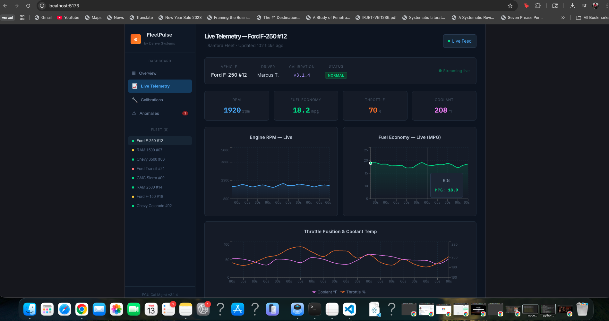

# RevLogic — ECU Telemetry Intelligence Dashboard



## Overview

RevLogic is a real-time automotive telemetry intelligence dashboard inspired by production fleet monitoring and ECU calibration platforms used in the automotive technology industry.

The platform simulates live vehicle telemetry streams and provides interactive analytics for fleet monitoring, anomaly detection, and ECU calibration analysis.

This project was designed to mirror real-world automotive software engineering workflows and demonstrate frontend engineering, state management, data visualization, and telemetry monitoring concepts.

---

## Features

### Real-Time Telemetry Monitoring
- Simulates live ECU telemetry streams
- Tracks:
  - RPM
  - Fuel Economy (MPG)
  - Throttle Position
  - Coolant Temperature
  - Idle Time

### Fleet Monitoring Dashboard
- Multi-vehicle fleet overview
- Interactive telemetry selection
- Live status indicators
- Fleet health analytics

### Anomaly Detection Engine
Automatically flags vehicles with:
- Excessive idle time
- Low fuel efficiency
- Sustained high RPM activity
- Outdated calibration versions

### Calibration Analytics
- Compare ECU software versions
- Analyze MPG improvements
- Track calibration deployment performance
- Monitor fleet-wide operational trends

### Interactive Data Visualization
Built using Recharts with:
- Live updating charts
- Area charts
- Line charts
- Bar charts
- Pie charts
- Interactive telemetry views

---

## Tech Stack

### Frontend
- React.js
- JavaScript
- Recharts
- CSS

### Development Tools
- Git
- GitHub
- Vite
- VS Code

---

## Project Structure

```bash
src/
 ├── App.jsx
 ├── main.jsx
 ├── index.css
 └── assets/
```

---

## What This Project Demonstrates

This project demonstrates:

- Frontend application architecture
- Real-time state management using React Hooks
- Dynamic UI rendering
- Interactive dashboard development
- Telemetry simulation workflows
- Data visualization engineering
- Debugging and modular component design
- Git-based development workflows

---

## Future Improvements

Potential future enhancements include:

### Backend Integration
- Node.js / Express backend
- REST API integration
- Real database connectivity
- WebSocket telemetry streaming

### Authentication & User Roles
- Login system
- Fleet manager access
- Technician dashboards
- Role-based permissions

### Predictive Analytics
- Machine learning anomaly detection
- Predictive maintenance recommendations
- Driver behavior analysis
- Fuel optimization suggestions

### Cloud & DevOps
- AWS deployment
- Docker containerization
- CI/CD pipelines
- Real-time cloud telemetry ingestion

### Mapping & Geolocation
- GPS tracking
- Route visualization
- Vehicle geofencing
- Fleet route optimization

---

## Installation

Clone the repository:

```bash
git clone https://github.com/shivanireddyk/RevLogic-ECU-Telemetry-Intelligence-Dashboard.git
```

Navigate into the project:

```bash
cd RevLogic-ECU-Telemetry-Intelligence-Dashboard
```

Install dependencies:

```bash
npm install
```

Install Recharts:

```bash
npm install recharts
```

Run the development server:

```bash
npm run dev
```

Open:

```bash
http://localhost:5173
```

---

## Inspiration

The dashboard design was inspired by modern telemetry and monitoring platforms such as:

- Grafana
- Datadog
- Tabler
- Fleet management dashboards
- Automotive telemetry systems

---

## Author

**Shivani Krishnama**

- GitHub: https://github.com/shivanireddyk
- LinkedIn: https://www.linkedin.com/in/shivani-krishnama-978640210/

---

## License

This project is intended for educational, portfolio, and demonstration purposes.
